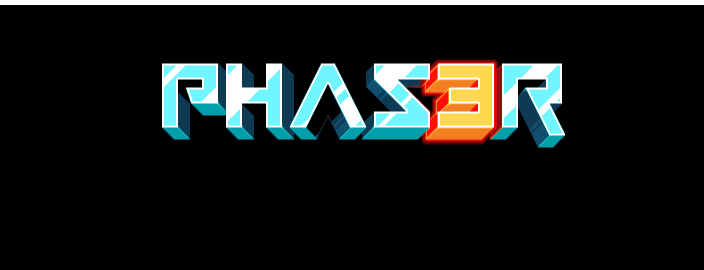

# Mise en place

## Premiers pas : mise en place du projet

Pour les premiers pas, il faut mettre en place le projet. 

Pour commencer:
* un petit `npm init`,
* Typescript, eslint ... : `npm install typescript eslint @typescript-eslint/eslint-plugin @typescript-eslint/parser --save-dev`,
* Comme bundler Parcel pour faire simple : `npm install parcel parcel-plugin-clean-easy parcel-plugin-static-files-copy --save-dev`.

Au sein d'un nouveau répertoire `src/`, création d'un fichier `index.html` et d'un fichier `main.ts`.

Le fichier index.html est simple pour le moment et devrait le rester :
```typescript
<html>
	<head>
		<title>MDN Portage Phase 3 & Typescript</title>
	</head>
	<body>
		<script src="main.ts" type="module"></script>
	</body>
</html>
```

Le fichier `main.ts` va contenir la définition du jeu, il va se compléxifier mais pour le moment, un console log va suffire:
```typescript
console.log("COUCOU !!");
```

Il faut également compléter le fichier `package.json` avec quelques commandes :
```
[...]
"scripts": {
		"start": "parcel src/index.html -p 8000",
		"build": "parcel build src/index.html --out-dir dist",
		"test": "echo \"Error: no test specified\" && exit 1",
		"lint": "eslint ./src --ext .js,.jsx,.ts,.tsx"
 },
[...]
```

Un premier test avec `npm start` et ouverture de la page `http://localhost:8080` qui n'affiche rien et c'est bien normal ! Juste un petit coucou dans le console.

Encore deux trois petites choses :
* Ajout d'un fichier `.gitignore` (issue de [gitignore.io](https://gitignore.io/)),
* Initialisation d'un repo `git init` et d'un premier commit,
* Ajout d'un paramétrage dans le package.json pour gérer les futurs fichiers static : (cela permet de forcer leur copie)
```
[...]
"staticFiles": {
		"staticPath": "src/assets",
		"watcherGlob": "**",
        "staticOutPath": "assets"
}
[...]
```
* Ajout d'un fichier _~/.parcelrc_ pour activer le plugin de copie :
```json
{
  "extends": ["@parcel/config-default"],
  "reporters":  ["...", "parcel-reporter-static-files-copy"]
}
```

## Mise en place de Phaser 3

Place à l'installation de Phaser : `npm install phaser`. La version utilisée au moment de l'écriture est __3.55.2__. Une fois la commande terminé, il faut mettre à jour le fichier `main.ts` pour initialiser la configuration du jeu. J'ai essayé de mettre un maximum de commentaire dans le code directement. Je complète au besoin ...
```typescript
// Je sais c'est pas bien, mais j'aime bien laisser un console.log au démarrage ...
console.log('-- Lancement du jeu');

// Import de la librairie
import Phaser from 'phaser'

// Import de la première scene.
// Les scènes peuvent être vu comme des espaces de jeu : un niveau, un plateau, une zone spécifique (comme le tableau de score).
import HelloWorldScene from './scenes/HelloWorldScene'

// La configuration
const config: Phaser.Types.Core.GameConfig = {
    type: Phaser.AUTO, // Phaser peut fonctionner soit en WebGL soit avec Canvas. En mettant auto, on le laisse choisir en fonction du navigateur,
    width: 800, // La taille du jeu
    height: 640,
    physics: {
        default: 'arcade', // Phaser intègre un moteur physique par défaut. N'ayant pas eu l'occasion de tester d'autres, je laisse celui par défaut.
        arcade: {
            gravity: { y: 200 }, // Ce moteur permet de gérer la gravité 
            debug: true
        }
    },
    scene: [HelloWorldScene]
}

// Export
export default new Phaser.Game(config)
```

A ce stade, la compilation ne fonctionne pas car la scène par défaut n'existe pas. Il faut ajouter un fichier `src/scenes/hello-wolrd.scene`. Pour cette première scène qui doit juste permettre le chargement d'un logo, une classe simple :
```typescript
import Phaser from 'phaser'

/**
 * La classe est une version simplifiée d'une classe présente dans un des tutos présents ci-dessus
 * */
export class HelloWorldScene extends Phaser.Scene {
    // Appeler par défaut au démarrage
    constructor() {
        // Passe une clé qui permettra de référencer la scène
        super('hello-world')
    }

    /***
     * La méthode est appelée après le constructeur et doit permettre le chargement
     * des assets ou autres composants nécessaires au jeu
     */
    preload() {
        // Permet de spécifier une URL de base pour le chargement des assets
        this.load.setBaseURL('http://labs.phaser.io')
        // Chargement d'un logo avec comme clé logo ...
        this.load.image('logo', 'assets/sprites/phaser3-logo.png')
    }

    /**
     * Après le preload, la méthode create est appelée.
     * Elle utilise (par exemple), les assets pour créer des éléments comme des images
     */
    create() {
        // Ici, uniquement une image qu'on place dans le jeu
        const logo = this.add.image(400, 100, 'logo')
    }
}
```

Bon pour le moment, le résultat n'est pas terrible mais au moins on a quelques choses à afficher :



## Début du portage

Le projet semble être capable de se construire et le jeu se charger. Il est de temps de commencer le portage ...


