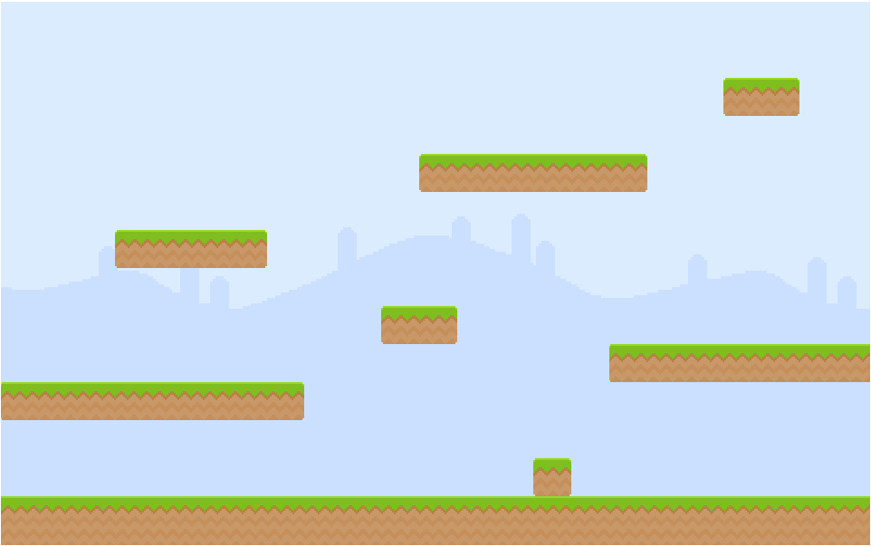

# Plateformes
## Mise en place

Comme il s'agit d'un jeu de plateformes, il faudrait placer des ... plateformes. Parmi les assets fournis, il y un fichier sympa : _~/src/assets/data/level00.json_ qui contient en fait les données sur le niveau : plateformes, pièces, ...

Le principe va donc être de lire le fichier pour créer les éléments nécessaires.

## Chargement du fichier Level

Le fichier étant dépendant du niveau et pas du jeu. Donc pour charger le fichier, il est possible de le faire dans la méthode preload de la scène
```typescript
[...]
preload() {
    // Chargement du niveau
    this.load.json(this.levelName, `./assets/data/${this.levelName}.json`);
}
[...]
create() {
    // [...] : Après la gestion du background
    // Creation du niveau
    this._createLevel(this.cache.json.get(this.levelName));
}

/**
 * Fonction spécifique pour créer les niveaux
 */
private _createLevel(data: any) {
    console.log(data);
}
```

La bonne nouvelle c'est que la console contient bien toutes les données. Par contre pour aller au bout de la logique, il faudrait créer des modeles pour avoir les entités. C'est parti :)
* Création du répertoire _~/src/models_,
* Création de BaseModel pour centraliser les coordonées,
* Création de PlateformModel, DecorationModel, CoinModel, HeroModel, SpiderModel, DoorModel et KeyModel,
* Puis enfin LevelModel.

La fonction _createLevel devient  : 
```typescript
private _createLevel(data: LevelModel) {
    console.log(data);
}
```

## Création des plateaux

Les plateaux utilisent des images qu'il faut ajouter au chargement dans la scène associée :
```typescript
// [...]
    preload() {
       // [...]

        // Chargement des différents images en lien avec les plateformes
        // /!\ Il faut que les codes images correspondent bien au code présent
        // dans le fichier de niveau
        this.load.image(AssetsList.IMG_ground, 'images/ground.png');
        this.load.image(AssetsList.IMG_Platform8x1, 'images/grass_8x1.png');
        this.load.image(AssetsList.IMG_Platform6x1, 'images/grass_6x1.png');
        this.load.image(AssetsList.IMG_Platform4x1, 'images/grass_4x1.png');
        this.load.image(AssetsList.IMG_Platform2x1, 'images/grass_2x1.png');
        this.load.image(AssetsList.IMG_Platform1x1, 'images/grass_1x1.png');
        // Vu que les codes sont dans les images, l'utilisation d'enum n'était peut-être
        // pas nécessaire.

    }
// [...]
```

Puis venir compléter la fonction *_createLevel* présent dans level1 :
```typescript
// [...]
    /**
     * Fonction spécifique pour créer les niveaux
     */
    private _createLevel(data: LevelModel) {
        // Gestion des plateformes
        data.platforms.forEach(this._createPlatform, this);
    }

    /**
     * Juste pour les plateaux
     * */
    private _createPlatform(platformModel: PlatformModel) {
        // Création des plateaux
        const sprite = this.add.sprite(platformModel.x, platformModel.y, platformModel.image);
        // Pour que le placement soit cohérent
        sprite.setOrigin(0, 0);
    }
// [...]

```

Après un rechargement, les plateaux semblent en place :



