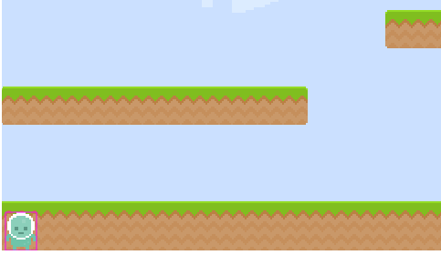
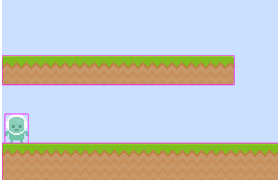

# Le Heros
## Introduction

Pour jouer, il faut un personnage et c'est l'objectif de cette partie.

## Création d'une entité

Afin d'éviter d'avoir du code un peu partout, la gestion du Hero va être centralisée dans une entité dédiée. Il faut commencer par créer _~/src/entities/hero.ts_ dont voici une première version :

```typescript
import { Physics } from 'phaser';
import { AssetsList } from '../consts';
import { HeroModel } from '../models/hero.model';

// La classe est une extension d'un sprite pour en avoir
// toutes les méthodes est service
export class Hero extends Physics.Arcade.Sprite {

    constructor(scene: Phaser.Scene, heroModel: HeroModel) {
        console.log(heroModel);
        // Il faut commencer par appeler le constructeur parent
        super(scene, heroModel.x, heroModel.y, AssetsList.IMG_Hero);

        // Ajout à la scéne
        scene.add.existing(this);
        // Mais également faisant partie de la "physic"
        scene.physics.add.existing(this);

        // Limite le hero à la zone de jeu
        (this.body as Physics.Arcade.Body).setCollideWorldBounds(true);
    }

}
```

Ce qui donne :

.

Deux points :
* Le personne est entouré de bord rouge : cela est du ai fait que le mode debug est activé pour la gravité dans le configuration,
* Le personne ne semble être bloqué par le sol : normal, on a rien fait pour cela,
* Par contre, il est bien bloqué au limite du jeu : cf. la dernière ligne du constructor.

## Modification de la gestion des plateformes.

Les platesformes sont bien crées mais elles ne sont pas associées mais elles n'ont pas de corps (body, physic) donc pas de gestion de collisions, etc... Pour corriger cela, il est possible de changer la création du sprite de :
```typescript
//   const sprite = this.add.sprite(platformModel.x, platformModel.y, platformModel.image);
const sprite = this.physics.add.sprite(platformModel.x, platformModel.y, platformModel.image);
```
Par contre, cette modification va avoir une première conséquence : vous allez voir les plateaux tombés. En effet, comme une gravité est définie elle agi sur les objets présents. Il faut donc supprimer cet effet : ```sprite.body.setAllowGravity(false);```.

Si vous relancez le jeu, vous allez voir le sol disparaître sous le joueur. En effet, en "tombant" le joueur va pousser la plateforme et la faire tomber. Autre action à effectuer, indiquer que les plateformes ne sont pas faîtes pour bouger : ``` sprite.body.setImmovable(true);```

A ce stade, les plateformes ne bougent plus mais notre héro tombe toujours. Il faut gérer la détection de la collision.

## Collision

La bonne nouvelle : Phaser le fait pour nous. Il faut juste lui dire ce qu'on attend.

Les deux premières actions sont :
* Création dans la scène d'une variable contenant les différents plateformes : ```protected _plateforms: Phaser.GameObjects.Sprite[] = [];```,
* Dans la fonction de création des plateformes, enregistrement dans le tableau :
```typescript
private _createPlatform(platformModel: PlatformModel) {
    // Les platesformes devant être physics, elles sont ajoutées à cette dimension
    const sprite = this.physics.add.sprite(platformModel.x, platformModel.y, platformModel.image);
    // [...]
    // Ajout au tableau
    this._plateforms.push(sprite);
}
```

Ensuite, il faut indiquer à Phaser de gérer la collision entre le hero et les plateformes. A ce niveau, une seule ligne à ajouter dans la  méthode create du niveau :
```typescript
 /**
 */
create() {

    // [...] Après la création des niveaux

    // Définition des collisions
    this.physics.add.collider(this._hero, this._plateforms);
}
```

Rien de plus. L'appel à cette méthode va simplement indiquer à Phaser que quand ils se rencontrent, ils doivent se bloquer. Notre petit heros est mieux placé :



## Retour sur la création des plateformes

Juste un petit rappel sur l'état de la fonction de création des plateformes :
```typescript
private _createPlatform(platformModel: PlatformModel) {
    // Les platesformes devant être physics, elles sont ajoutées à cette dimension
    const sprite = this.physics.add.sprite(platformModel.x, platformModel.y, platformModel.image);
    // Par contre, pour éviter qu'elle tombe, il faut leur dire que la gravité n'a pas d'impact
    sprite.body.setAllowGravity(false);
    // Et pour éviter que si quelqu'un marche dessus, la plateforme glisse
    sprite.body.setImmovable(true);
    // Pour que le placement soit cohérent
    sprite.setOrigin(0, 0);
    // Ajout au tableau
    this._plateforms.push(sprite);
    }
```

## Faut pas rester là ... faut bouger maintenant

Notre héros est là mais pour le moment, il ne peut rien faire. Ce serait bien qu'il puisse un peu bouger histoire de ne pas être totalement inutile. Retour dans la classe du héros pour gérer cela.

Phaser étant bien sympathique, il permet de détecter l'appel au clavier soit pour des touches spécifiques soit pour des certaines disont très utilisées comme haut, bas, gauche et droite. Pour accéder à cela, il suffit :
* d'ajouter une proprité à la classe Héro : ```private cursors: Phaser.Types.Input.Keyboard.CursorKeys;```,
* de l'initialiser dans le constructeur : ``` this.cursors = this.scene.input.keyboard.createCursorKeys();```.

Maintenant, il faut l'utiliser au bon endroit. Dans la gestion du jeu, nous avons vu que Phaser "proposait" l'utilisation de plusieurs méthodes dont il se charge de l'appel : preload et create. Il en existe d'autres comme update. La méthode update est appelée à chaque boucle du jeu et permet d'influer sur le rendu en fonction de l'action du joueur.

Il existe également une autre méthode preUpdate qui peut être implémenté sur un sprite. C'est cette solution qui va être utilisée.

## Déclaration de la méthode preUpdate

Voici une première version de cette méthode :
```typescript
preUpdate() {
    // Par défaut, il ne doit pas bouger
    this.body.velocity.x = 0;

    // Gestion de doite et gauche
    if (this.cursors.left.isDown) {
        // Le joueur veut aller à gauche
        this.body.velocity.x = -1 * Hero.SPEED;
    }
    else if (this.cursors.right.isDown) {
        // Le joeur veur aller à droite
        this.body.velocity.x = 1 * Hero.SPEED;
    }

    // Gestion du saut
    if (this.cursors.up.isDown) {
        // Est-ce qu'il n'est pas déjà en cours de saut ?
        if (this.body.touching.down) {
            // RAPPEL : 0,0 c'est en haute. Donc quand il saute,
            // il descend :)
            this.body.velocity.y = -1 * Hero.JUMP;
        }
    }
}
```

Les fonctions et propriétés sont assez explicites. Les deux seules choses :
* Il faut bien se souveniir que le point 0,0 est en haut à gauche (pour le saut ...),
* Qu'on veut éviter que l'utilisateur puisse sauter deux fois. Donc avant de valider, une vérification est faîte qu'il est bien en contact avec quelque chose.

A noter que la descente n'est pas gérée : Phaser s'en occupe via la pomme de Newton. Par contre, à ce stade, le hero peut atteindre la plateau le plus haut d'un seul coût ce qui simplifie un peu trop sa tâche. Il faut renforcer le pouvoir d'attraction en modifiant un paramètre dans la configuration du jeu :
```
// [...]
arcade: {
    gravity: { y: 1200 }, // Passage de 200 à 1200
    debug: true
}
//[...]
```

C'est déjà plus raisonnable.


