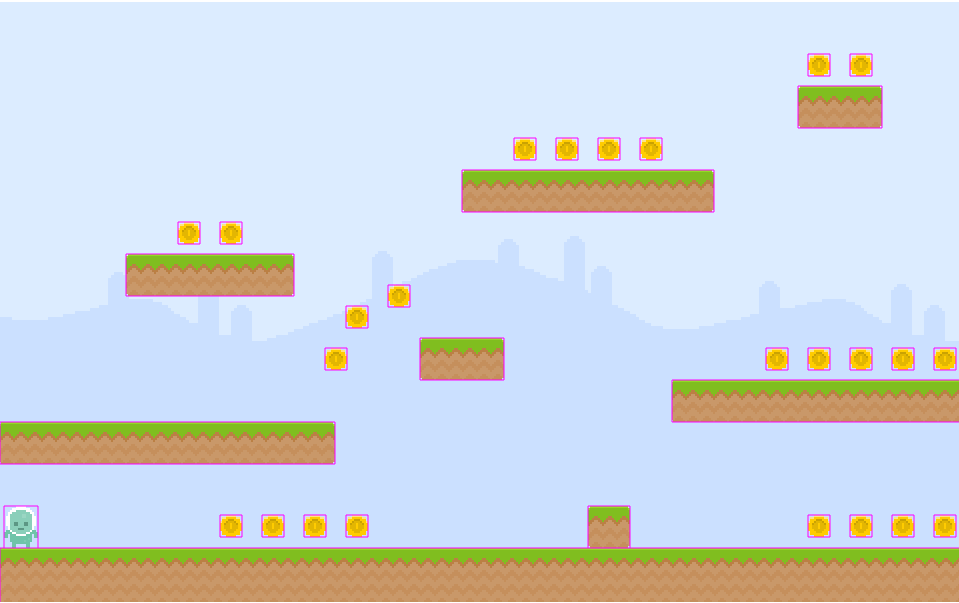

# Un jeu de plateformes sans pièces
_Ce n'est pas un jeu de plateformes..._

## Intro

Le but de cette partie va être de disposer des pièces dans le jeu et de permettre au héro de les récolter. Sur le principe, cela va être très proche de la mise en place des plateformes mais avec la mise en place d'animations pour que les pièces bougent.

## Chargement

Comme toujours, il faut commencer par aller charger l'asset dans la scéne dédiée :
```typescript
// [...]
preload() {
    // [...]
    // Gestion des pièces
    // Il faut indiquer la taille d'une image dans l'image pour qu'il puisse faire le découpage nécessaire
    this.load.spritesheet(AssetsList.SPRITESHEET_COINS, 'images/coin_animated.png', { frameWidth: 22, frameHeight: 22 });
    // [...]
}
// [...]
```
Pour les pièces, il faut utiliser autre chose qu'un image : spritesheet. Pour comprendre pourquoi, ouvrez le fichier et vous verrez que l'image contient en fait plusieurs "bouts" qui vont nous donner l'animation de la pièce.

## Création d'une entité

Afin d'éviter de surcharger la scène Level, les pièces sont initialisées dans une entité dédiée (ce qu'il aurait fallu faire pour plateforme ...).

Voici la première version qui permet à minima d'afficher les pièces :
```typescript
import { Physics } from 'phaser';
import { AssetsList } from '../consts';
import { CoinModel } from '../models/coin.model';

// La classe est une extension d'un sprite pour en avoir
// toutes les méthodes est service
export class Coin extends Physics.Arcade.Sprite {

    constructor(scene: Phaser.Scene, coinModel: CoinModel) {

        // Il faut commencer par appeler le constructeur parent
        // --> Il faut bien passer la bonne texture
        super(scene, coinModel.x, coinModel.y, AssetsList.SPRITESHEET_COINS);

        // Ajout à la scéne
        scene.add.existing(this);
        // Mais également faisant partie de la "physic"
        scene.physics.add.existing(this);

        // Gestion du corps (comme plateforme)
        // Sinon les pièces tombent ou peuvent bouger
        const body = this.body as Phaser.Physics.Arcade.Body;
        body.setAllowGravity(false);
        body.setImmovable(true);
    }
}
```

Puis, il ne faut pas oublier de modifier la scène pour créer les pièces :
```typescript
/**
 * Fonction spécifique pour créer les niveaux
 */
private _createLevel(data: LevelModel) {
    // Gestion des plateformes
    data.platforms.forEach(this._createPlatform, this);

    // Gestion du heros
    this._hero = new Hero(this, data.hero);

    // Gestion des pièces
    data.coins.forEach((coinModel: CoinModel) => {
        this._coins.push(
            new Coin(this, coinModel)
        );
    }, this);

}
```

Normalement vous devez voir cela :



## Un peu d'animations

Afin d'utiliser l'animation et rendre cela jolie, il faut retourner dans le constructeur de notre pièce pour ajouter l'animation :
```typescript
constructor(){
    // [...]
    // A la fin.

    // Création de l'animation de rotation des pièces
    this.scene.anims.create({
        key: Coin.COINANIM,
        frameRate: 6, // Vitesse de la rotation
        repeat: -1, // Tourne toujours
        frames: this.anims.generateFrameNumbers(AssetsList.SPRITESHEET_COINS, { frames: [0, 1, 2, 1] })
    });
    // Une fois crée, on la lance
    this.anims.play(Coin.COINANIM, true);

}
```

Les pièces tournent :).

## La collecte

Elles sont là, c'est sympa mais pour le moment, le personnage les traverses sans trop de souci. Comme pour les plateformes, il faut gérer une collision mais ici avec un peu plus d'impact.

Dans la fonction create, ajouter une gestion de collisions :
```typescript
create() {
    // [...]
    // -- Hero avec Pièce
    this.physics.add.overlap(this._hero, this._coins, (hero, coin) => coin.destroy())
}
```

Première différence : utilisation d'overlap plutôt que collider. Cela implique que la joueur peut passer devant la pièce. Deuxième différence, ajout d'une fonction pour permettre de décider ce qu'il faut faire. Dans notre cas, destruction pure et simple de la pièce (pour le moment).


