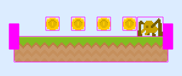
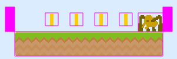

# Les ennemis
_Après les pièces ... un peu de bestioles ..._

## On recommence un peu pareil

Entre les pièces et les ennemis, au moins pour le départ, pas trop de différence sur les actions :
* Dans la scène de chargement, chargement (:)) de l'image : ```this.load.spritesheet(AssetsList.SPRITESHEET_Spider, 'images/spider.png', { frameWidth: 42, frameHeight: 32 });```,
* Création d'une classe Spider :
```typescript
import { Physics } from 'phaser';
import { AssetsList } from '../consts';
import { SpiderModel } from '../models/spider.model';

// La classe est une extension d'un sprite pour en avoir
// toutes les méthodes est service
export class Spider extends Physics.Arcade.Sprite {

    static readonly MOVEANIM = 'move';
    static readonly DIEANIM = 'die';
    static readonly SPEED = 100;

    constructor(scene: Phaser.Scene, spiderModel: SpiderModel) {

        // Il faut commencer par appeler le constructeur parent
        // --> Il faut bien passer la bonne texture
        super(scene, spiderModel.x, spiderModel.y, AssetsList.SPRITESHEET_Spider);

        // Ajout à la scéne
        scene.add.existing(this);
        // Mais également faisant partie de la "physic"
        scene.physics.add.existing(this);

        // Quelques ajustements 
        const body = this.body as Phaser.Physics.Arcade.Body;
        body.setCollideWorldBounds(true); // au cas où pour qu'ils sortent du jeu,
        body.velocity.x = Spider.SPEED; // ils bougent tout le temps et tout seul

        // Création des animations :
        // -- La première quand il bouge
        this.scene.anims.create({
            key: Spider.MOVEANIM,
            frameRate: 8, // Vitesse de la rotation
            repeat: -1, // Tourne toujours
            frames: this.anims.generateFrameNumbers(AssetsList.SPRITESHEET_Spider, { frames: [0, 1, 2] })
        });
        // -- La deuxèime quand il meurt
        this.scene.anims.create({
            key: Spider.DIEANIM,
            frameRate: 8, // Vitesse de la rotation
            repeat: 0, // Tourne toujours
            frames: this.anims.generateFrameNumbers(AssetsList.SPRITESHEET_Spider, { frames: [0, 4, 0, 4, 0, 4, 3, 3, 3, 3, 3, 3] })
        });
        // Une fois crée, on la lance
        this.anims.play(Spider.MOVEANIM, true);

    }
}
```
* Ajout des araignés dans la méthode qui gère la création du niveau :
```typescript
//[...]
private _createLevel(data: LevelModel) {
    // [...]

    // Gestion des araignées
    data.spiders.forEach((spiderModel: SpiderModel) => {
        this._spider.push(
            new Spider(this, spiderModel)
        );
    }, this);

}
```

A ce stade, vous devez avoir des araignés qui apparaissent mais qui tombent des plateformes pour aller se coller dans le coin en bas à droite.

.

Même si elles ne peuvent pas sortir du jeu, rien ne les bloquent autrement donc elles bougent ...

## Bloqué !

Une première chose simple à faire; indiquer dans la gestion des collisions que les araignés sont bloquées par les platesformes : 
```
create() {
    // [...]
    // -- Araignes avec plateforme
    this.physics.add.collider(this._spider, this._plateforms);
}
```
## Mais pas assez

La solution proposée dans le tutoriel initial est de mettre en place des murs invisibles qui vont bloqués nos petites bêtes et leur demander de repartir en arrière.

Les premières étapes sont identiques et connues depuis quelques temps maintenant :
* Chargement de l'image : ```this.load.image(AssetsList.IMG_Walls, 'images/invisible_wall.png');```,
* Création d'une classe enemyWalls :
```typescript
import { Physics } from 'phaser';
import { AssetsList } from '../consts';

// Pour bien gérer la position, il sera nécessaire d'indiquer
// si le mur est sur le côté gauche ou droit de la plateforme
export enum EnemyWallSide {
    left = 'left',
    right = 'right'
}

// La classe est une extension d'un sprite pour en avoir
// toutes les méthodes est service
export class EnemyWall extends Physics.Arcade.Sprite {

    static readonly COINANIM = 'rotate';

    constructor(scene: Phaser.Scene, x: number, y: number, side: EnemyWallSide) {

        // Il faut commencer par appeler le constructeur parent
        // --> Il faut bien passer la bonne texture
        super(scene, x, y, AssetsList.IMG_Walls);

        // Ajout à la scéne
        scene.add.existing(this);
        // Mais également faisant partie de la "physic"
        scene.physics.add.existing(this);

        // Gestion du corps (comme plateforme)
        // Sinon les pièces tombent ou peuvent bouger
        const body = this.body as Phaser.Physics.Arcade.Body;
        body.setAllowGravity(false);
        body.setImmovable(true);

    }
}
```
* Création des murs au même moment que la création des plateformes :
```typescript
// [...]
private _createPlatform(platformModel: PlatformModel) {
    // ---- Création de la plateforme
    // [...]

    // --- Création des murs invisibles de chaque côté de la plateforme
    this._enemyWalls.push(
        new EnemyWall(this, sprite.x, sprite.y, EnemyWallSide.left),
        new EnemyWall(this, sprite.x + sprite.width, sprite.y, EnemyWallSide.right)
    );
}
```

Ce qui bloque déjà un peu mieux :

.

Par contre, les murs ne sont très bien placés. Cela est du au fait qu'ils sont placés en fontion de leur centre. Il faut effectuer une modification de l'origine au moment de leur création :
```typescript
constructor([...]) {
    // [...]
    // Correction du point d'origine
    // C'est toujours en bas y = 1
    // par contre si mur de gauche, le point d'origine est à droite (1,1)
    // si mur de droite c'est à gauche (0, 1)
    this.setOrigin(
        side === EnemyWallSide.left ? 1 : 0,
        1
    );
}
```

Les murs sont déjà mieux placés :

.

Par contre, elles restent toujours bêtement dans le coin sans revenir sur leur pas.

## Aller - retour

Pour changer cela, il est possible d'utiliser la méthode preUpdate de la classe Spider pour changer de sens en fonction des contacts :
```typescript
preUpdate(time, delta) {
    // Nécessaire pour que l'animation fonctionne encore
    super.preUpdate(time, delta);

    // Récupération du body avec le bon type
    const body = this.getBody();

    // Mise à jour en fonction des contacts
    if (body.touching.right || body.blocked.right) {
        body.velocity.x = -1 * Spider.SPEED;
    }
    else if (body.touching.left || body.blocked.left) {
        body.velocity.x = Spider.SPEED;
    }
}
```

Deux points qui m'ont fait perdre du temps :
* preUpdate : il faut appeler la version parente. Sinon certaines actions sont perdues comme les animations,
* velocity.x passe à 0: c'est assez logique quand l'araigné est bloqué sa vitesse passe à 0. Il est donc obligatoire de la ré-initialiser.

Les araignés se déplacent et restent sur les plateaux. Il reste simplement à rendre invisible les murs ce qui est faisable directement dans la classe associée :
```typescript
// [...]
constructor() {
    // [...]
    // Pas besoin de les voir
    this.setVisible(false);
}
```

Bon pour le moment, ils sont toujours visibles à cause du mode debug de la gravité.

## Let's fight !

Tout se joue au niveau des collisions qu'il va falloir détecter et gérer.

Pour commencer, ajout de méthodes sur le héros :
* Une méthode pour savoir s'il est entrain de tomber,
* une méthode pour qu'il puisse faire un petit rebond.

```typescript
// [...]
export class Hero extends Physics.Arcade.Sprite {
    // [...]
    // Une vitesse de rebond 
    static readonly BOUNCE_SPEED = 200;
    // [...]

    /**
     * Vrai si la vélocité y est > 0
     * @returns bool
     */
    public isFalling(): boolean {
        return this.body.velocity.y > 0;
    }

    /**
     * Un petit effet rebond
     */
    public bounce() {
        this.body.velocity.y = -Hero.BOUNCE_SPEED;
    }
}

```

Idem au niveau de l'araigné. Une méthode qui va venir gérer son décès :
```typescript
// [...]
export class Spider extends Physics.Arcade.Sprite {
    // [...]
    /**
     * Une araignée meurt
     */
    public die() {
        // On commence par rendre son corps inactif
        // Pour que le hero ne meurt pas à cause du cadavre
        this.body.enable = false;
        // Arrêt de l'animation en cours
        this.anims.stop();
        // Ecoute pour savoir quand on peut supprimer
        // Quand l'animation est terminée
        this.once('animationcomplete', () => this.destroy(), this);
        // Joue l'animation de mort
        this.anims.play(Spider.DIEANIM);
    }
}
```

A noter qu'il faut également mettre à jour la méthode preUpdate. En effet, en désactivant le body il n'est plus accessible donc risque d'erreur dans l'exécution :
```typescript
// [...]
export class Spider extends Physics.Arcade.Sprite {
     // [...]
         /**
     * Gestion de la mise à jour entre deux refresh
     * @param time 
     * @param delta 
     */
    preUpdate(time, delta) {
    // Nécessaire pour que l'animation fonctionne encore
    super.preUpdate(time, delta);

    // Récupération du body avec le bon type
    const body = this.getBody();

    if (this.body) {
        if (body.touching.right || body.blocked.right) {
            body.velocity.x = -1 * Spider.SPEED;
        }
        else if (body.touching.left || body.blocked.left) {
            body.velocity.x = Spider.SPEED;
        }
    }
        
}

```

et finalement la gestion de la collision :
```typescript
// [...]
export class LevelOneScene extends Phaser.Scene {
    // [...]
    create() {
        // [...]
        // -- Hero avec araignés
        this.physics.add.overlap(this._hero, this._spider, this._handleHeroAndSpider, null, this);
    }

     /**
     * Gestion d'un contact entre notre hero et une araigné
     * Tout va dépendre qui touche qui et comment
     * @param hero Le hero
     * @param spider L'araigné
     */
    private _handleHeroAndSpider(heroGO: GameObjects.GameObject, spiderGO: GameObjects.GameObject) {
        // Cast
        const hero = heroGO as Hero;
        const spider = spiderGO as Spider;

        // Est-ce que le heros est en train de tomber ?
        if (hero.isFalling()) {
            // Oui alors, on considère qu'il peut tuer l'araigné
            // Un petit rebond pour la classe
            hero.bounce();
            // L'araigné meurt
            spider.die();
        } else {
            // Oups ... Pour le moment, on relance le jeu
            this.scene.restart();
        }

    } // _handleHeroAndSpider
}
```

## Petit point étape

Ca avance : le joueur bouge, les araignés aussi, il peut collecter des pièces, combat possible ... Ca commence à ressemble à quelque chose.

