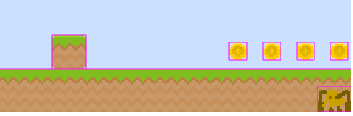

# Les ennemis
_Après les pièces ... un peu de bestioles ..._

## On recommence un peu pareil

Entre les pièces et les ennemis, au moins pour le départ, pas trop de différence sur les actions :
* Dans la scène de chargement, chargement (:)) de l'image : ```this.load.spritesheet(AssetsList.SPRITESHEET_Spider, 'images/spider.png', { frameWidth: 42, frameHeight: 32 });```,
* Création d'une classe Spider :
```typescript
import { Physics } from 'phaser';
import { AssetsList } from '../consts';
import { SpiderModel } from '../models/spider.model';

// La classe est une extension d'un sprite pour en avoir
// toutes les méthodes est service
export class Spider extends Physics.Arcade.Sprite {

    static readonly MOVEANIM = 'move';
    static readonly DIEANIM = 'die';
    static readonly SPEED = 100;

    constructor(scene: Phaser.Scene, spiderModel: SpiderModel) {

        // Il faut commencer par appeler le constructeur parent
        // --> Il faut bien passer la bonne texture
        super(scene, spiderModel.x, spiderModel.y, AssetsList.SPRITESHEET_Spider);

        // Ajout à la scéne
        scene.add.existing(this);
        // Mais également faisant partie de la "physic"
        scene.physics.add.existing(this);

        // Quelques ajustements 
        const body = this.body as Phaser.Physics.Arcade.Body;
        body.setCollideWorldBounds(true); // au cas où pour qu'ils sortent du jeu,
        body.velocity.x = Spider.SPEED; // ils bougent tout le temps et tout seul

        // Création des animations :
        // -- La première quand il bouge
        this.scene.anims.create({
            key: Spider.MOVEANIM,
            frameRate: 8, // Vitesse de la rotation
            repeat: -1, // Tourne toujours
            frames: this.anims.generateFrameNumbers(AssetsList.SPRITESHEET_Spider, { frames: [0, 1, 2] })
        });
        // -- La deuxèime quand il meurt
        this.scene.anims.create({
            key: Spider.DIEANIM,
            frameRate: 8, // Vitesse de la rotation
            repeat: -2, // Tourne toujours
            frames: this.anims.generateFrameNumbers(AssetsList.SPRITESHEET_Spider, { frames: [0, 4, 0, 4, 0, 4, 3, 3, 3, 3, 3, 3] })
        });
        // Une fois crée, on la lance
        this.anims.play(Spider.MOVEANIM, true);

    }
}
```
* Ajout des araignés dans la méthode qui gère la création du niveau :
```typescript
//[...]
private _createLevel(data: LevelModel) {
    // [...]

    // Gestion des araignées
    data.spiders.forEach((spiderModel: SpiderModel) => {
        this._spider.push(
            new Spider(this, spiderModel)
        );
    }, this);

}
```

A ce stade, vous devez avoir des araignés qui apparaissent mais qui tombent des plateformes pour aller se coller dans le coin en bas à droite.

.

Même si elles ne peuvent pas sortir du jeu, rien ne les bloquent autrement donc elles bougent ...

