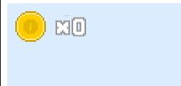
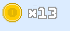

# Gestion d'un score
## Introduction
L'idée ici est d'ajouter une zone en haut de l'écran pour compter le nombre de pièces collectées par notre héro.

Ici, c'est un peu navigation a vu car il semble que pas mal de choses aient changés entre la version 2 & 3 au niveau des retroFonts et aucune documentation précise augmente.

De plus, la solution proposée n'est pas celle directement utilisée dans le tutoriel d'origine mais une combinaison de plusieurs solutions trouvées dans différents exemples.

## Comme toujours, le chargement

Dans la scène de chargement, il faut ajouter les éléments nécessaires. Il faut également mettre à jour les différents enums :
```typescript
preload() {
    // [...]
    // La pièce pour le score
    this.load.image(AssetsList.IMG_Coin, 'images/coin_icon.png');

    // Le tableau des scores
    this.load.image(AssetsList.IMG_FontNumber, 'images/numbers.png');
    // [...]
}
```

## Ensuite un container

Pour afficher le score qui doit présenter une pièce et le score, il faut associer différents éléments : une image de pièce + le texte. L'idée est de créer un composant intégrant les deux que l'on peut placer ensemble.

Pour cela, il est possible d'utiliser un container. L'avantage est qu'en positionnant le container, les éléments contenus sont positionnés ensemble.

Création d'une classe ScoreContainer contenu dans _~/src/ui/score.container.ts_ :
```typescript
export class ScoreContainer extends Phaser.GameObjects.Container {
}
```

C'est ici que le nombre de pièces collectées est gérée donc ajout d'une variable :
```typescript
export class ScoreContainer extends Phaser.GameObjects.Container {

    /**
     * La valeur qui doit être affichée
     */
    protected _value = 0;

    public get value() {
        return this._value;
    }

    /**
     * Doit pouvoir être manipulée de l'extérieur
     * */
    public set value(value: number) {
        this._value = value;
    }

}
```

Maintenant, il faut commencer l'ajout des différents composants au sein du constructeur :
```typescript
export class ScoreContainer extends Phaser.GameObjects.Container {

    // Les chiffres sous forme de chaîne
    // Nécessaire pour la fonction RetroFont pour trouver les
    // bons caractères dans l'image
    static readonly NUMBERS_STR = '0123456789X ';

    // C'est cette propriété qui va être mise à jour
    // quand le score va changer. Il faut donc pouvoir
    // la référencée.
    protected dynamic: Phaser.GameObjects.BitmapText;

    // [...]

    constructor(scene: Phaser.Scene, x: number, y: number) {
        // L'appel au parent
        super(scene, x, y);

        // Création de la pièce
        // --> Les coordonnées sont relatives au container.
        let coinIcon = scene.add.image(0, 0, AssetsList.IMG_Coin);
        coinIcon.setOrigin(0, 0);

        // Mise en cache de l'image que Phaser va découper via
        // RetroFont.
        // Avec les différents paramètres, il sera capable de traduire
        // une chaine de texte en chaîne d'image
        scene.cache.bitmapFont.add(
            AssetsList.IMG_FontNumber,
            Phaser.GameObjects.RetroFont.Parse(scene, {
                image: AssetsList.IMG_FontNumber,
                width: 20, height: 26,
                chars: ScoreContainer.NUMBERS_STR,
                charsPerRow: 6,
                "spacing.x": 0,
                "spacing.y": 0,
                lineSpacing: 1,
                "offset.x": 0,
                "offset.y": 0
            })
        );

        // Mais au final, c'est cette image qui sera mise à jour.
        // Via la référence au cache, il est capable de recalculer
        // l'image à chaque changement de valeur.
        this.dynamic = scene.add.bitmapText(
            coinIcon.x + coinIcon.width + 10,
            coinIcon.height / 2,
            AssetsList.IMG_FontNumber);
        this.dynamic.setOrigin(0, 0.5);
        // A noter que l'utilisation des mêmes codes n'est sans doute pas une bonne idée ...

        // Pour que les éléments soient effectivement considérés
        // dans le container, il faut les ajouter.
        this.add(coinIcon);
        this.add(this.dynamic);
    }
}
```

Une dernière chose : gestion de la mise à jour du texte :
```typescript
export class ScoreContainer extends Phaser.GameObjects.Container {
    // [...]
    preUpdate() {
        this.dynamic.text = `X${this.value}`;
    }
}
```

C'est bien directement l'image bitmapText qui est mise à jour. Ensuite, un recalcul sera fait pour générer l'image qui sera basé sur les éléments présents dans l'image de base.

## Une scène UI

Le container pourrait être directement affiché dans la scène du niveau. Mais cela ne semble pas être une bonne pratique et il est plutôt recommandé de mettre cela dans une scène à part.

Création d'une scène dédie UIScene dans _~/src/scenes/UIScene.ts_. Cette scène est pour le moment très simple :
```typescript
import { Scene } from 'phaser';
import { AssetsList, EventList, ScenesList } from '../consts';
import { ScoreContainer } from '../ui/score.container';

export class UIScene extends Scene {
    private scoreContainer!: ScoreContainer;

    /**
     * 
     */
    constructor() {
        super(ScenesList.UIScene);
    }

    /**
     * Creation ...
     */
    create() {
        // Création du conteneur qui affiche le score
        this.scoreContainer = new ScoreContainer(this, 10, 10);
        this.add.existing(this.scoreContainer);
    }

}
```

Pour que la scène soit chargée, deux choses à faire :
* La référencer dans la configuration du jeu : (ne pas oublier l'import)
```
    // [...]
    scene: [LoadingScene, LevelOneScene, UIScene]
    // [...]
```
* Demander son lancement au même moment que le niveau :
```typescript
export class LoadingScene extends Phaser.Scene {
    // [...]
    create() {
        // Comme il s'agit uniquement de la page de chargement,
        // Ouverture du premier tableau : La scene 1
        this.scene.start(ScenesList.Level1Scene);
        // Puis lancement de l'UI
        this.scene.run(ScenesList.UIScene);
    }
}
```

A ce stade, une pièce avec un score à 0 doit apparaître :

.

## Mise à jour du score

La mise à jour du score doit se faire quand une pièce est collecté. Pour ce faire, un évènement est émis et doit être capté.

Une liste d'évènements est ajoutée au constantes :
```typescript
export enum EventList {
    GET_COIN = 'GET_COIN',
    KILL_SPIDER = 'KILL_SPIDER',
    HERO_JUMP = 'HERO_JUMP'
}
```
_Anticipation de certaines évolutions ?_

Puis, un évènement est lancé quand une pièce est collecté :
```typescript
export class LevelOneScene extends Phaser.Scene {
    // [...]
/**
     */
    create() {

        // [...]

        // -- Hero avec Pièce
        this.physics.add.overlap(this._hero, this._coins, (hero, coin) => {
            // Destruction de la pièce
            coin.destroy()
            // Events indiquant que la pièce a été captée
            this.game.events.emit(EventList.GET_COIN);
        });
        // [...]
    }
    // [...]
}
```

Enfin, l'évènement est capturé pour mettre à jour le score :
```typescript
export class UIScene extends Scene {
    // [...]
    create() {
        // [...]
        this.game.events.on(EventList.GET_COIN, this.manageGetCoin, this);
    }

    /**
     * Gère quand notre héros capture une pièce
     */
    private manageGetCoin() {
        this.scoreContainer.value += 1;
    }

}
```

Et normalement quand notre héros collecte des pièces :



