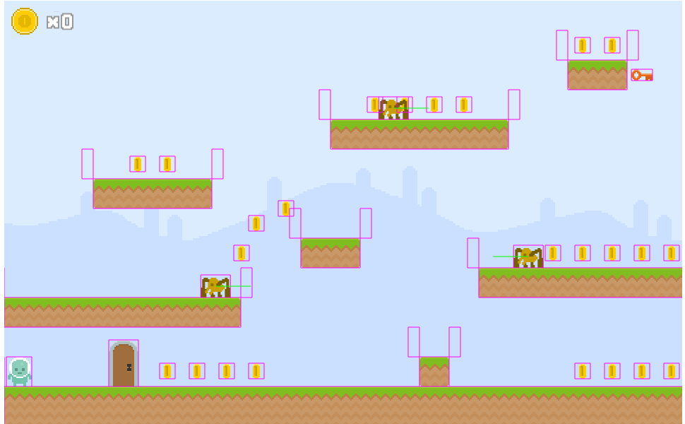
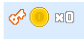
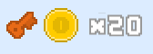

# Victoire
## Introduction
Le joueur peut perdre mais il ne peut pas gagner. Une porte et une clé sont ajoutées poure remédier à ce point.

## Chargement

Etape quasiment de routines maintenant : ajout des assets images et son pour les nouveaux éleménts :
```typescript
export class LoadingScene extends Phaser.Scene {
    // [...]
     preload() {
        // [...]
        this.load.spritesheet(AssetsList.SPRITESHEET_Door, 'images/door.png', { frameWidth: 42, frameHeight: 66 });
        this.load.image(AssetsList.IMG_Key, 'images/key.png');
        this.load.spritesheet(AssetsList.SPRITESHEET_KeyIcon, 'image/key_icon.png', { frameWidth: 34, frameHeight: 30 });
        // [...]
        this.load.audio(AssetsList.SND_Door, 'audio/door.wav');
        this.load.audio(AssetsList.SND_Key, 'audio/key.wav')
     }

    // [...]
}
```

## Création d'entité

Une première pour la porte :
```typescript
import { Physics } from 'phaser';
import { AssetsList } from '../consts';
import { DoorModel } from '../models/door.model';

// La classe est une extension d'un sprite pour en avoir
// toutes les méthodes est service
export class Door extends Physics.Arcade.Sprite {

    constructor(scene: Phaser.Scene, doorModel: DoorModel) {

        // Il faut commencer par appeler le constructeur parent
        // --> Il faut bien passer la bonne texture
        super(scene, doorModel.x, doorModel.y, AssetsList.IMG_Door);

        // Ajout à la scéne
        scene.add.existing(this);
        // Mais également faisant partie de la "physic"
        scene.physics.add.existing(this);

        // Gestion du corps (comme plateforme)
        // Sinon les pièces tombent ou peuvent bouger
        const body = this.body as Phaser.Physics.Arcade.Body;
        body.setAllowGravity(false);
        body.setImmovable(true);

        // Mise à jour de l'origin pour placer la porte en fonction
        // du milieu en "bas"
        this.setOrigin(0.5, 1);

    }
}
```

et une deuxième pour la clé :
```typescript
import { Physics } from 'phaser';
import { AssetsList } from '../consts';
import { KeyModel } from '../models/key.model';

// La classe est une extension d'un sprite pour en avoir
// toutes les méthodes est service
export class Key extends Physics.Arcade.Sprite {

    constructor(scene: Phaser.Scene, keyModel: KeyModel) {

        // Il faut commencer par appeler le constructeur parent
        // --> Il faut bien passer la bonne texture
        super(scene, keyModel.x, keyModel.y, AssetsList.IMG_Key);

        // Ajout à la scéne
        scene.add.existing(this);
        // Mais également faisant partie de la "physic"
        scene.physics.add.existing(this);

        // Gestion du corps (comme plateforme)
        // Sinon les pièces tombent ou peuvent bouger
        const body = this.body as Phaser.Physics.Arcade.Body;
        body.setAllowGravity(false);
        body.setImmovable(true);

        this.setOrigin(0.5, 0.5);
    }

}
```

## Ajout dans la scéne

Dans Phaser, l'ordre d'ajout des éléments est important : il détermine qui est affiché devant qui quand un objet passe devant un autre. Donc comme il faut que la porte et la clé soit derrière, il faut les ajouter en premier.

```typescript
// [...]
export class LevelOneScene extends Phaser.Scene {
    // [...]
     private _createLevel(data: LevelModel) {
         // Gestion des plateformes
        data.platforms.forEach(this._createPlatform, this);

        // Gestion de la porte et de la clé
        this._door = new Door(this, data.door);
        this._key = new Key(this, data.key);


        // Gestion du heros
        this._hero = new Hero(this, data.hero);

        // [...]

    }
    // [...]
}
```

Et normalement :

.

## Règles

Pour gagner, le hero doit collecter la clé puis passer la porte.

Ajout d'une information sur le hero permettant d'indiquer qu'il a bien collecté la clé :
```typescript
export class Hero extends Physics.Arcade.Sprite {
    // [...]
    // Vrai si le joueur à collecter la clé
    private _hasKey: boolean = false;
    public get HasKey(): boolean { return this._hasKey; }
    public set HasKey(value: boolean) { this._hasKey = value; }
    // [...]
}
```

Détection de la collision entre le joueur et la clé en cas de de rencontre :
```typescript
export class LevelOneScene extends Phaser.Scene {
    // [...]
    create() {
        // [...]
         // -- Hero avec la clé
        this.physics.add.overlap(this._hero, this._key, (hero, key) => {
            // Mise à jour du hero
            this._hero.HasKey = true;
            // Suppression de la clé
            key.destroy();
            // Event
            this.game.events.emit(EventList.GET_KEY);
        })
        // [...]
    }
    // [...]
}
```

Puis la même chose avec la porte. Ici, un fonction supplémentaire est passée qui permet de valider qu'effectivement, la collision peut être gérée :
```typescript
export class LevelOneScene extends Phaser.Scene {
    // [...]
    create() {
        // [...]
        // -- Hero avec la clé
         // -- Hero avec la porte
        this.physics.add.overlap(this._hero, this._door,
            // Gestion de la collision                
            () => {
                // Event
                this.game.events.emit(EventList.OPEN_DOOR);
                // Relance du jeu
                this.scene.restart();
            },
            // Est-ce qu'il faut gérer la collision
            () => {
                // Oui, si le hero a la clé et qu'il touche le sol
                // On prend pas la porte par le dessus !
                return this._hero.HasKey && this._hero.body.touching.down;
            }
        )
        // [...]
    }
    // [...]
}
```

## Correction d'une anomalie

Le mode debug permet de constater une anomalie dans le jeu : quand le joueur part vers la gauche, sa zone de corps est détaché de son image. Cela génère des comportements étranges comme être touché de loin ou passer entre les murs.

Le souci vient de la méthode checkFlip. En changeant de sens, il faut également déplacer la partie physique :
```typescript
 protected checkFlip(): void {
    if (this.body.velocity.x < 0) {
        this.scaleX = -1;
        this.body.setOffset(this.width, 0);
    } else {
        this.scaleX = 1;
        this.body.setOffset(0, 0);
    }
}
```

Il faut jouer sur l'offset.

## Affichage de la clé

Quand le joueur collecte la clé, il serait intéressant de le mettre en avant. Une icône a été chargée en même temps que l'image de la clé et de la porte. 

L'idée étant de l'afficher à côté du score, il faut modifier le container du score.

```typescript
export class ScoreContainer extends Phaser.GameObjects.Container {
    // [...]
    // L'image
    private _key!: Phaser.GameObjects.Image;

    // Vrai si le joueur à la clé
    private _hasKey = false;
    public get HasKey(): boolean { return this._hasKey; }
    public set HasKey(value: boolean) { this._hasKey = value; }

    // [...]

     constructor(scene: Phaser.Scene, x: number, y: number) {
        super(scene, x, y);

        // Création de la clé
        this._key = scene.add.image(0, 19, AssetsList.SPRITESHEET_KeyIcon);
        this._key.setOrigin(0, 0.5);


        // Création de la pièce
        // Il faut modifier sa position par rapport à la clé
        let coinIcon = scene.add.image(this._key.width + 7, 0, AssetsList.IMG_Coin);
        coinIcon.setOrigin(0, 0);

        // [...]

        // Ajout dans le container
        this.add(this._key);
        this.add(coinIcon);
        this.add(this.dynamic);
}
```

Et la clé apparaît :

.

Une dernière chose : quand le joueur collecte la clé, il faut mettre à jour cette icone.

Au niveau d'UI, un écouteur est présente pour émettre un son au moment de la collecte de la clé. Il peut servir pour mettre à jour le container score :
```typescript
export class UIScene extends Scene {
    // [...]
    create() {
        // [...]
        // -- Récupération de la clé
        this.game.events.on(EventList.GET_KEY, () => {
            this.sound.play(AssetsList.SND_Key);
            this.scoreContainer.HasKey = true;
        });
        // -- Gestion de la porte
        this.game.events.on(EventList.OPEN_DOOR, () => this.sound.play(AssetsList.SND_Door));

    }
}
```

Puis, mise à jour du container :
```typescript
preUpdate() {
        this.dynamic.text = `X${this.value}`;
        this._key.setFrame(this.HasKey ? 1 : 0);
}
```

Et après la collecte de la clé, l'icône change :

.

## Une animation sur la clé

La clé étant un élément important, il faut le metttre en avant. Un moyen est d'ajouter un tween (interpolation) sur la clé :
```typescript
scene.tweens.add({
    targets: this,
    y: { from: this.y - 3, to: this.y + 6 },
    yoyo: true,
    ease: 'Linear',
    duration: 1000,
    repeat: -1,
});
```


